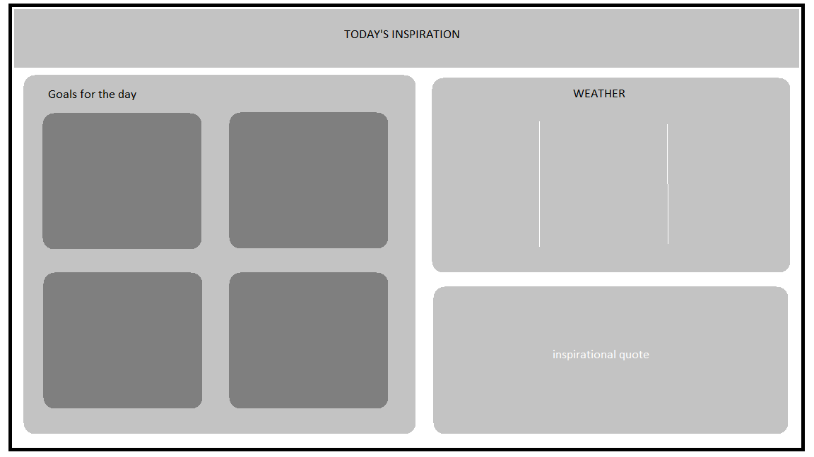

# Inspirational Homepage

This is a project made for a Codecademy course. 
My goal was to create a React app whre the use can set goals and mark them as done, get the current weather, get an inspirational quote and interact with the background image.
This project uses different APIs.

[See result here](https://daily-inspo-page.netlify.app/)

## Wireframes 

This is a rough idea of what I want the page to look like.

## Technologies used

- HTML
- CSS
- JavaScript, including requests to APIs ([Quotable](https://github.com/lukePeavey/quotable), [Unsplash](https://unsplash.com/developers) and [OpenWeather](https://openweathermap.org/api))
- React
- Redux
- Git and GitHub
- Deployment with Netlify

## Features 

- Users can check the current weather
- Users are shown an inspirational image
- Users can cycle through multiple fetched images
- Users are shown an inspirational quote
- Users can write down their goals
- Users can delete goals
- Users can mark goals as complete

## Future work

- Make app responsive
- Display weather using geolocation
- Improve Lighthouse score